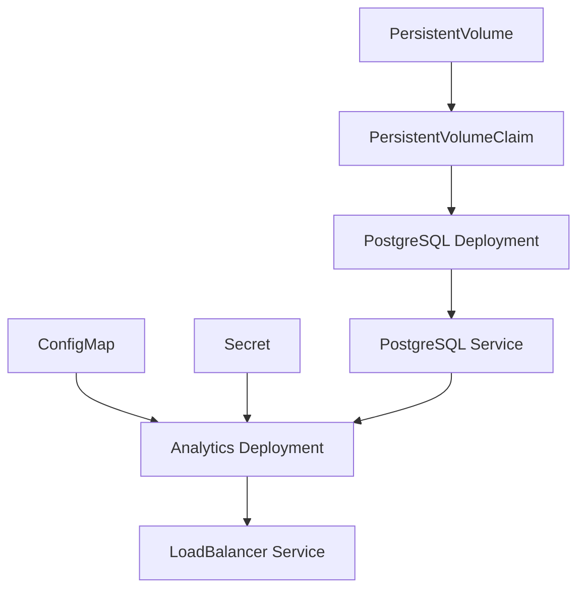

# Coworking Analytics Application - Deployment Documentation

A containerized Flask-based analytics application with automated CI/CD pipeline, deployed on Kubernetes with PostgreSQL database and AWS-managed infrastructure.

## Architecture Overview

### Technology Stack

- **Application**: Python 3.11, Flask 2.3.3, psycopg2-binary
- **Containerization**: Docker with multi-stage builds
- **Orchestration**: Kubernetes with LoadBalancer services
- **CI/CD**: AWS CodeBuild with GitHub integration
- **Registry**: Amazon ECR for container image storage
- **Database**: PostgreSQL 15+ with persistent storage
- **Monitoring**: CloudWatch Container Insights

### Infrastructure Components

- **AWS Account**: 767398149973 (us-east-1)
- **ECR Repository**: `coworking-analytics`
- **CodeBuild Project**: `coworking-analytics-build`
- **Kubernetes Cluster**: EKS or local cluster
- **Database**: PostgreSQL with persistent volumes

## Build and Deploy Process

### CI/CD Pipeline Architecture

The deployment process follows a GitOps workflow with automated builds:

1. **Source Control**: GitHub repository triggers builds on commits
2. **Build Automation**: AWS CodeBuild executes `buildspec-working.yaml`
3. **Container Registry**: Docker images pushed to ECR with semantic versioning
4. **Deployment**: Kubernetes manifests applied to cluster
5. **Monitoring**: CloudWatch logs and Container Insights

### Build Pipeline Details

**CodeBuild Configuration** (`deployments/buildspec-working.yaml`):

```yaml
version: 0.2
phases:
  pre_build:
    commands:
      - aws ecr get-login-password --region us-east-1 | docker login --username AWS --password-stdin 767398149973.dkr.ecr.us-east-1.amazonaws.com
  build:
    commands:
      - docker build -t coworking-analytics:1.0.0 ./analytics
      - docker tag coworking-analytics:1.0.0 767398149973.dkr.ecr.us-east-1.amazonaws.com/coworking-analytics:1.0.0
      - docker tag coworking-analytics:1.0.0 767398149973.dkr.ecr.us-east-1.amazonaws.com/coworking-analytics:latest
  post_build:
    commands:
      - docker push 767398149973.dkr.ecr.us-east-1.amazonaws.com/coworking-analytics:1.0.0
      - docker push 767398149973.dkr.ecr.us-east-1.amazonaws.com/coworking-analytics:latest
```

**Key Design Decisions**:

- Direct ECR URLs instead of environment variables (avoids YAML parsing issues)
- Semantic versioning with build numbers
- Dual tagging strategy (versioned + latest)
- Simplified artifacts configuration

## Deployment Process

### Kubernetes Resource Hierarchy

The application follows a layered deployment approach:

1. **Storage Layer**: PersistentVolume → PersistentVolumeClaim
2. **Database Layer**: PostgreSQL Deployment → Service
3. **Configuration Layer**: ConfigMap + Secret
4. **Application Layer**: Analytics Deployment → LoadBalancer Service

### Resource Dependencies



### Deployment Commands

```bash
# Database infrastructure
kubectl apply -f deployments/pvc.yaml
kubectl apply -f deployments/pv.yaml
kubectl apply -f deployments/postgresql-deployment.yaml
kubectl apply -f deployments/postgresql-service.yaml

# Application configuration
kubectl apply -f deployments/configmap.yaml
kubectl apply -f deployments/secret.yaml

# Application deployment
kubectl apply -f deployments/coworking-deployment.yaml
```

## Release Management

### Semantic Versioning Strategy

The application uses semantic versioning with the following pattern:

- **Major.Minor.Patch**: `1.0.0` for stable releases
- **Build Numbers**: `$CODEBUILD_BUILD_NUMBER` for CI builds
- **Latest Tag**: Always points to the most recent build

### Release Process

#### Automated Releases (Recommended)

1. **Code Changes**: Commit to `main` branch
2. **Build Trigger**: CodeBuild automatically builds and pushes to ECR
3. **Image Update**: Update `coworking-deployment.yaml` with new image tag
4. **Deployment**: Apply updated Kubernetes manifests
5. **Verification**: Run health checks and smoke tests

#### Manual Releases

```bash
# Build and push manually
docker build -t coworking-analytics:1.1.0 ./analytics
docker tag coworking-analytics:1.1.0 767398149973.dkr.ecr.us-east-1.amazonaws.com/coworking-analytics:1.1.0
docker push 767398149973.dkr.ecr.us-east-1.amazonaws.com/coworking-analytics:1.1.0

# Update deployment
kubectl set image deployment/coworking coworking=767398149973.dkr.ecr.us-east-1.amazonaws.com/coworking-analytics:1.1.0
```

### Rollback Strategy

```bash
# Rollback to previous version
kubectl rollout undo deployment/coworking

# Rollback to specific revision
kubectl rollout undo deployment/coworking --to-revision=2

# Check rollout status
kubectl rollout status deployment/coworking
```

## Configuration Management

### Environment Variables

**ConfigMap** (`deployments/configmap.yaml`):

- `DB_HOST`: Database service name
- `DB_USERNAME`: Database user
- `DB_PORT`: Database port
- `DB_NAME`: Database name

**Secret** (`deployments/secret.yaml`):

- `DB_PASSWORD`: Base64 encoded database password

### Resource Limits and Requests

The deployment includes resource constraints:

```yaml
resources:
  requests:
    memory: "256Mi"
    cpu: "250m"
  limits:
    memory: "512Mi"
    cpu: "500m"
```

## Monitoring and Observability

### Health Checks

The application implements Kubernetes-native health checks:

- **Liveness Probe**: `/health_check` endpoint
- **Readiness Probe**: `/readiness_check` endpoint
- **Probe Configuration**: 5s initial delay, 2s timeout

### Logging Strategy

- **Application Logs**: Structured logging to stdout
- **CloudWatch Integration**: Container Insights enabled
- **Log Aggregation**: Centralized logging via CloudWatch

### Monitoring Commands

```bash
# Application health
kubectl get pods -l service=coworking
kubectl logs -l service=coworking --tail=50

# Database health
kubectl get pods -l app=postgresql
kubectl logs -l app=postgresql --tail=50

# Service endpoints
kubectl get svc
kubectl describe svc coworking
```

## Troubleshooting Guide

### Common Issues

#### Build Failures

- **YAML Parsing Errors**: Use `buildspec-working.yaml` (simplified format)
- **ECR Push Failures**: Verify IAM permissions and ECR repository exists
- **Docker Build Failures**: Check Dockerfile syntax and dependencies

#### Deployment Issues

- **Image Pull Errors**: Verify ECR image exists and permissions
- **Database Connection**: Check ConfigMap/Secret values and network policies
- **Resource Constraints**: Monitor CPU/memory limits and adjust if needed

#### Runtime Issues

- **Health Check Failures**: Review application logs and database connectivity
- **Service Discovery**: Verify service names and DNS resolution
- **Persistent Storage**: Check PVC status and storage class

### Debugging Commands

```bash
# Pod debugging
kubectl describe pod <pod-name>
kubectl logs <pod-name> --previous

# Service debugging
kubectl get endpoints
kubectl describe svc <service-name>

# Storage debugging
kubectl get pv,pvc
kubectl describe pvc <pvc-name>
```

## Security Considerations

### Container Security

- **Non-root User**: Application runs as non-root user (UID 1000)
- **Minimal Base Image**: Python 3.11-slim for reduced attack surface
- **Dependency Scanning**: Regular updates of Python packages

### Kubernetes Security

- **RBAC**: Role-based access control for cluster access
- **Network Policies**: Pod-to-pod communication restrictions
- **Secret Management**: Kubernetes secrets for sensitive data
- **Resource Limits**: Prevents resource exhaustion attacks

### AWS Security

- **IAM Roles**: Least privilege access for CodeBuild and ECR
- **Encryption**: ECR images encrypted at rest
- **VPC**: Network isolation for EKS clusters

## Performance Optimization

### Resource Sizing

- **Recommended Instance**: t3.medium (2 vCPU, 4GB RAM)
- **Database**: PostgreSQL with persistent storage
- **Application**: Horizontal scaling with HPA

### Cost Optimization

- **Spot Instances**: Use for non-critical workloads
- **Reserved Instances**: 1-3 year commitments for predictable workloads
- **Right-sizing**: AWS Compute Optimizer recommendations
- **Auto Scaling**: HPA based on CPU/memory metrics

## Development Workflow

### Local Development

```bash
# Run locally with Docker
docker build -t coworking-analytics .
docker run --network="host" coworking-analytics

# Test endpoints
curl http://localhost:5153/health_check
curl http://localhost:5153/api/reports/daily_usage
```

### Testing Strategy

- **Unit Tests**: Python application tests
- **Integration Tests**: Database connectivity tests
- **End-to-End Tests**: Full API workflow tests
- **Load Testing**: Performance validation

### Code Quality

- **Linting**: Python code style enforcement
- **Security Scanning**: Container vulnerability scanning
- **Dependency Updates**: Regular package updates
- **Documentation**: API documentation and code comments

## Future Enhancements

### Scalability Improvements

- **Horizontal Pod Autoscaling**: CPU/memory-based scaling
- **Database Read Replicas**: Improved read performance
- **Caching Layer**: Redis for session management
- **CDN Integration**: Static asset delivery

### Monitoring Enhancements

- **Custom Metrics**: Application-specific monitoring
- **Alerting**: Proactive issue detection
- **Distributed Tracing**: Request flow visualization
- **Performance Profiling**: Bottleneck identification

### Security Enhancements

- **Service Mesh**: Istio for advanced networking
- **Pod Security Policies**: Runtime security enforcement
- **Network Segmentation**: Micro-segmentation
- **Compliance**: SOC2/PCI DSS compliance

---

This documentation provides a comprehensive guide for developers to understand, deploy, and maintain the Coworking Analytics application. For specific implementation details, refer to the individual YAML files in the `deployments/` directory.
# Test webhook automation - 10/05/2025 16:42:10

# Webhook test - 10/05/2025 16:43:08

